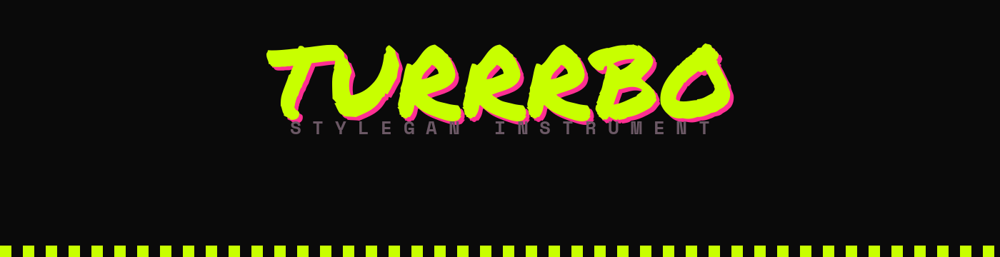
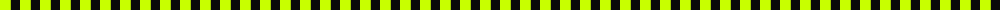

<div align="center">



<br>

[](#-a-note-on-licensing)
[](#-technical-requirements)
[](#-download)
[](#-built-with)

**`FREE 4EVER`** ✦ **`NO WI-FI NEEDED`** ✦ **`NON-COMMERCIAL & PROUD`** ✦ **`WEIRD ON PURPOSE`**

</div>



## ✦ What this is

TURRRBO is a free, offline desktop application for generating images from latent space using pretrained StyleGAN2 models. It runs entirely on your machine — no internet connection, no API key, no subscription.

This is not a text-to-image tool. You are not typing prompts and getting illustrations. You are navigating a mathematical space that a neural network learned by looking at thousands of real images — and pulling out what lives there.

**The results are weirder. More specific. More yours.**


## ✦ Download

Get the current build free on Gumroad — pay what you want, no account required.

<div align="center">

### **[→ schwwaaa.gumroad.com/l/turrrbo](https://schwwaaa.gumroad.com/l/turrrbo)**

</div>

Full usage docs live at **[turrrbo.app/docs](https://turrrbo.app/docs.html)**.


## ✦ Table of Contents

- [What's Inside](#-whats-inside)
- [Controls](#-controls-that-actually-mean-something)
- [Style Routes](#-9-style-routes)
- [CLIP Text Guidance](#-clip-text-guidance-optional)
- [Templates](#-8-built-in-templates)
- [Who This Is For](#-fit-check)
- [Technical Requirements](#-technical-requirements)
- [A Note on Licensing](#-a-note-on-licensing)
- [Development](#-development)
- [Built With](#-built-with)


## ✦ What's Inside

5 pretrained models, each a different visual territory:

| Model | Dataset | Resolution | Territory |
|---|---|---|---|
| **Synthetic Portraits** | FFHQ | 1024px | 70,000 human faces collapsed and remixed into synthetic identities. Coherent at mid settings. Dissolves into anatomy-horror at the extremes. |
| **Museum Wreckage** | MetFaces | 1024px | Portrait paintings from the Metropolitan Museum of Art. Painterly surfaces, visible brushwork, art-historical drift. |
| **Haunted Schematics** | LSUN Churches | 256px | Architecture with recombinant structural logic — arches and spires merged in ways that feel almost recognizable. |
| **Animal Forms** | AFHQ Cats | 512px | Feline anatomy that abstracts into fur-texture fields under pressure. |
| **Automotive Drift** | LSUN Cars | 512px | Chrome logic, strange reflections, body lines that almost make sense. |


## ✦ Controls that actually mean something

| Control | What it does |
|---|---|
| **Seed** | Each integer is a different identity, a different location in the model's learned world. |
| **Truncation ψ** | How far from the average to go. Low = safe. High = strange. |
| **Split truncation** | Push pose and texture in different directions simultaneously. |
| **Noise strength** | Flood the surface with stochastic detail. |
| **Style mixing** | Let two seeds share one image — coarse structure from one, fine texture from another. |


## ✦ 9 Style Routes

Named artistic modes, not sliders you have to guess at:

`Ghost Contour` · `Thermal Hallucination` · `Overexposed Memory` · `Broken Chroma` · `TV Wreckage` · `Cartoon Corrosion` · `Structure Transplant` · `Fine Transplant`

### ✎ CLIP Text Guidance (optional)

Type a description and the latent vector optimizes toward it. Not a prompt engine — a steering mechanism. Effective prompts describe visual qualities, not subjects.


## ✦ 8 Built-in Templates

Starting points that demonstrate what the models can do:

`Raw Output` · `Average Collapse` · `Full Chaos` · `Structure Swap` · `Split Truncation` · `Noise Flood` · `Ghost`


## ✦ Fit Check

<table>
<tr>
<td valign="top" width="50%">

**This is for you if —**

- You're an artist bored of the same AI aesthetic.
- You're a designer who wants source material that doesn't look like everyone else's source material.
- You're a photographer or collage artist looking for synthetic textures, faces, and forms to work with.
- You're an experimenter who wants to understand how these models actually behave — not just what they produce when you ask nicely.
- You find glitches, artifacts, and model failures more interesting than clean photorealistic output.

</td>
<td valign="top" width="50%">

**This is not for you if —**

- You want photorealistic images from text prompts — use Midjourney or Stable Diffusion instead.
- You want an image that could have come from anywhere. TURRRBO is for images that feel like they came from somewhere specific — a model with character, trained on a particular dataset, pushed into territory it was never meant to go.

</td>
</tr>
</table>


## ✦ Technical Requirements

| | |
|---|---|
| **OS** | macOS 12 Monterey or later (Apple Silicon M1/M2/M3 recommended) |
| **Memory** | 8 GB RAM minimum, 16 GB recommended for the 1024px models |
| **Storage** | ~3 GB disk space |
| **Setup** | No Python, no terminal, no setup — for end users. (Building from source needs both — see below.) |
| **Network** | No internet connection required after install |


## ✦ A Note on Licensing

> TURRRBO uses pretrained model weights from NVIDIA Research. These weights are licensed for **non-commercial use only**. That means TURRRBO is free — and must stay free.
>
> This is not a limitation. It's the whole point.


## ✦ Development

This section is for building TURRRBO from source, not for end users — grab the packaged app from [Gumroad](https://schwwaaa.gumroad.com/l/turrrbo) instead unless you're contributing.

### Stack

- **Shell:** [Tauri](https://tauri.app/) (Rust)
- **Frontend:** React + TypeScript, Vite
- **Backend:** Python / FastAPI, packaged as a PyInstaller sidecar
- **Inference:** [StyleGAN2-ADA-PyTorch](https://github.com/NVlabs/stylegan2-ada-pytorch)

### Prerequisites

- Node.js + npm
- Rust toolchain (`rustup`)
- Python 3.10+ with a virtualenv at `backend/env`
- `numpy<2.0` (required — the StyleGAN2 checkpoints depend on the legacy `numpy.core` API)

### Setup

```bash
git clone <this-repo>
cd TURRRBO
npm install

# pull model weights into backend/models
npm run stage:models
```

### Run in dev mode

```bash
npm run tauri:dev
```

This runs the Python backend (`backend/api/server.py`, port `47474`) and the Tauri/Vite frontend concurrently. The backend reads models from `backend/models` in dev mode.

### Build a release

```bash
npm run tauri:build
# or, for just the .dmg:
npm run make:dmg
```

`src-tauri/resources/models` is symlinked to `backend/models` — the bundler follows the symlink and copies real files into the packaged app, so there's only one physical copy of the weights on disk.

### Scripts

| Script | What it does |
|---|---|
| `npm run tauri:dev` | Backend + frontend + Tauri shell, all together, hot-reloading |
| `npm run tauri:build` | Full production build |
| `npm run make:dmg` | Package the `.dmg` |
| `npm run backend` | Run just the Python backend |
| `npm run stage:models` | Download/verify model weights |


## ✦ Built With

`Tauri` · `Rust` · `React` · `TypeScript` · `Python` · `FastAPI` · `PyInstaller` · `StyleGAN2-ADA-PyTorch`

Model weights courtesy of **NVIDIA Research**, non-commercial license.

<br>

<div align="center">
<sub>No servers were harmed in the making of this image, because there are no servers.</sub>
</div>
